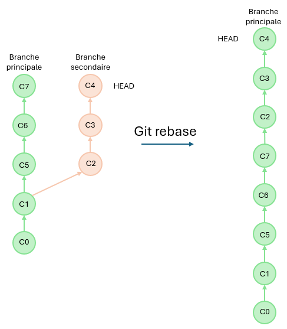

# Les bases du git

## Créer un repo git depuis gitLab

Depuis gitLab, créez un nouveau dépôt git puis clonez le sur votre machine
```bash
# Récupérer le projet en local
git clone https://git.univ-pau.fr/username/nom_depot

# Créer la branche principale
git branch main

# Ajouter les accès distants
git remote add origin mais
```

## Créer une branche
```bash
git branch nom_de_la_nouvelle_branche
```

## Se positionner sur une branche ou un commit
Supposons l'arborescence git suivante:


### Positionner la tête sur la branche souhaitée

```bash
git checkout nom_branche
```


### Positionner la tête sur le commit précédent

```bash
git checkout HEAD-1
```


### Positionner la tête sur un commit précis

```bash
git checkout c1
```


## Remonter une sous branche sur la tête de la branche parente 

```bash
# Se positionner sur la branche à relever (ex: branche_secondaire)
git checkout branche_secondaire


# Effectuer un rebasesur la branche souhaité (ex: branche principale)
git rebase branche_principale
```

___Remarque___ : Rebase une branche peut apporter son lot de problèmes. En effet, si vous avez modifier les mêmes sections de code sur les mêmes fichiers sur les deux branches il va falloir réparer toutes les conflits entre temps.

___Astuce___ : N'hesitez pas à demander de l'aide ;)

## Merge une branche

```bash
# Se positionner sur la branche à merge
git checkout branche_secondaire

# Effectuer un merge
git merge branche_principale --rebase
```



___Remarque___ : Par sécurité, il vaut mieux toujours faire une "merge request" directement sur gitLab (ou gitHub) au lieu de merge directement. Cela permet d'ajouter des "reviewer" qui permettront la merge. Vaut mieux avoir plusieurs fautifs qu'un seul ;)